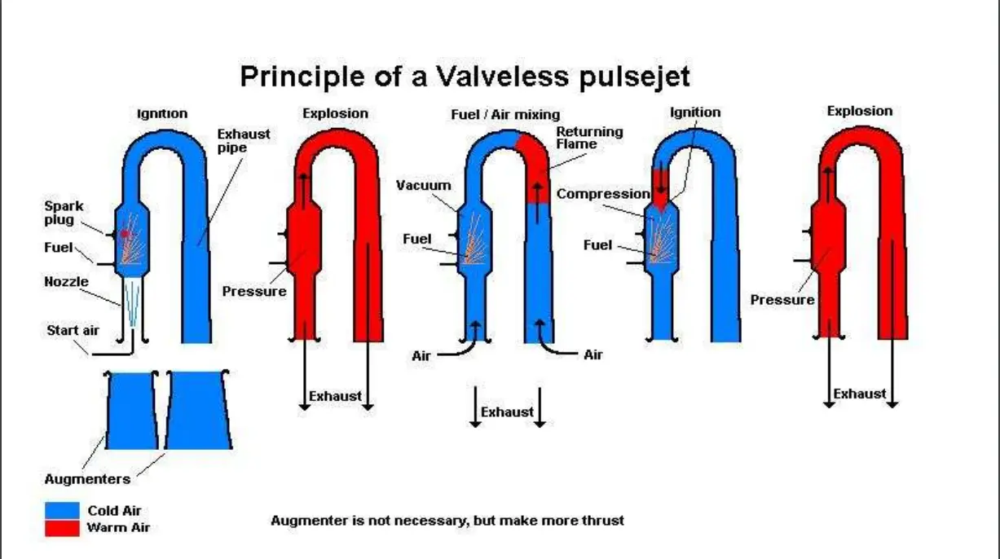
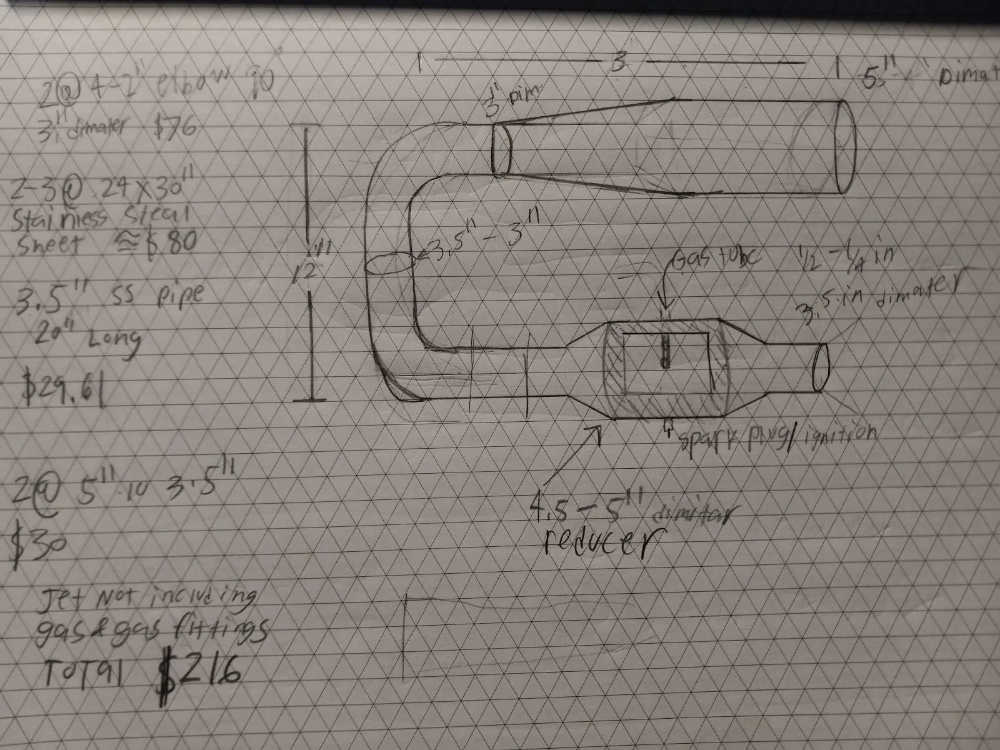
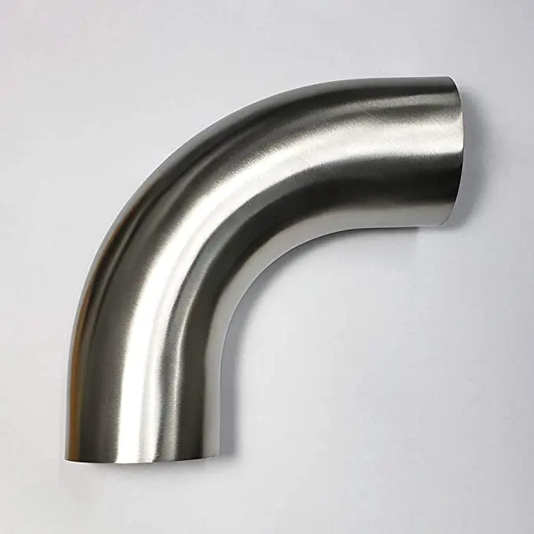
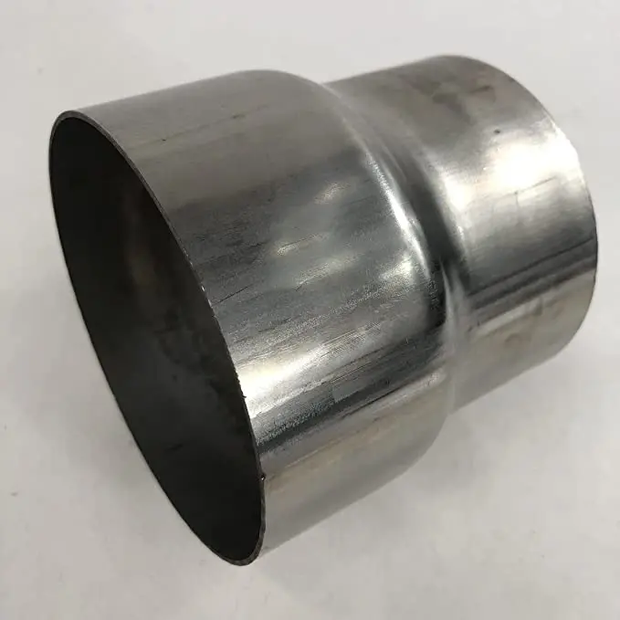
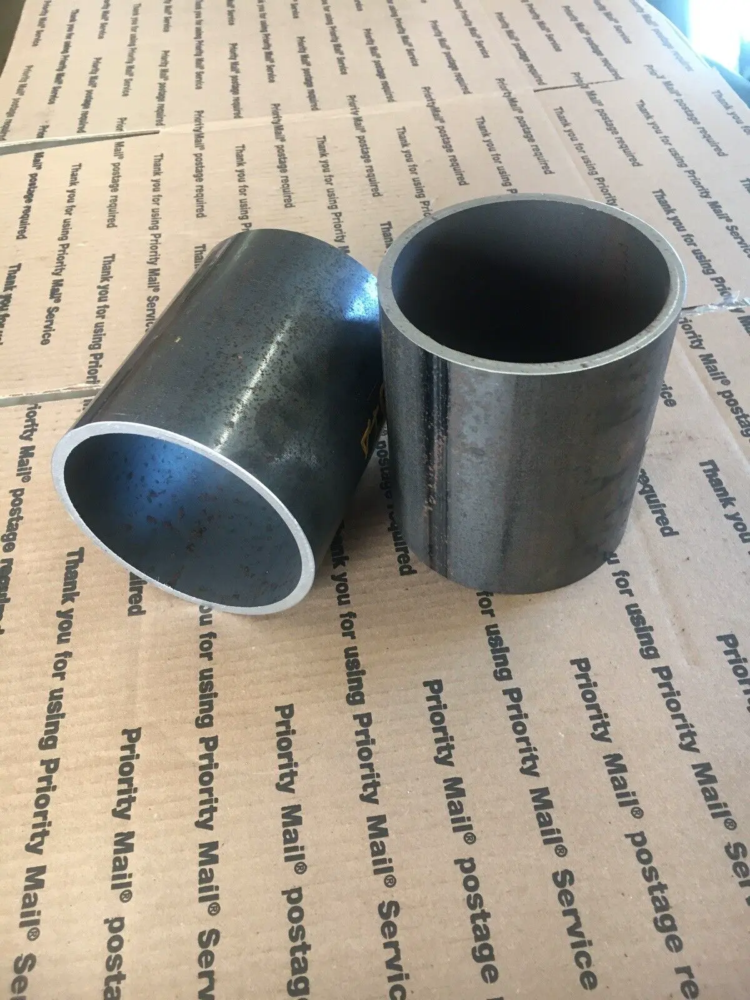
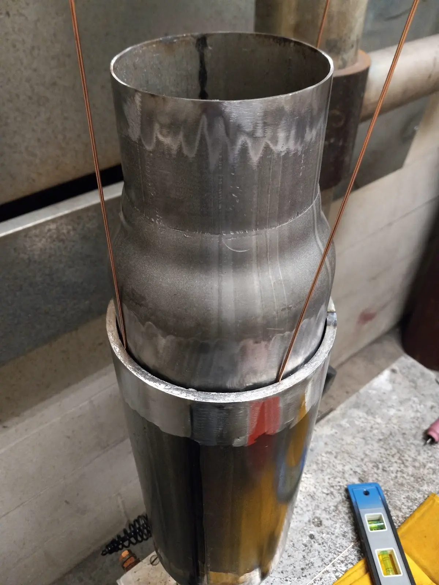
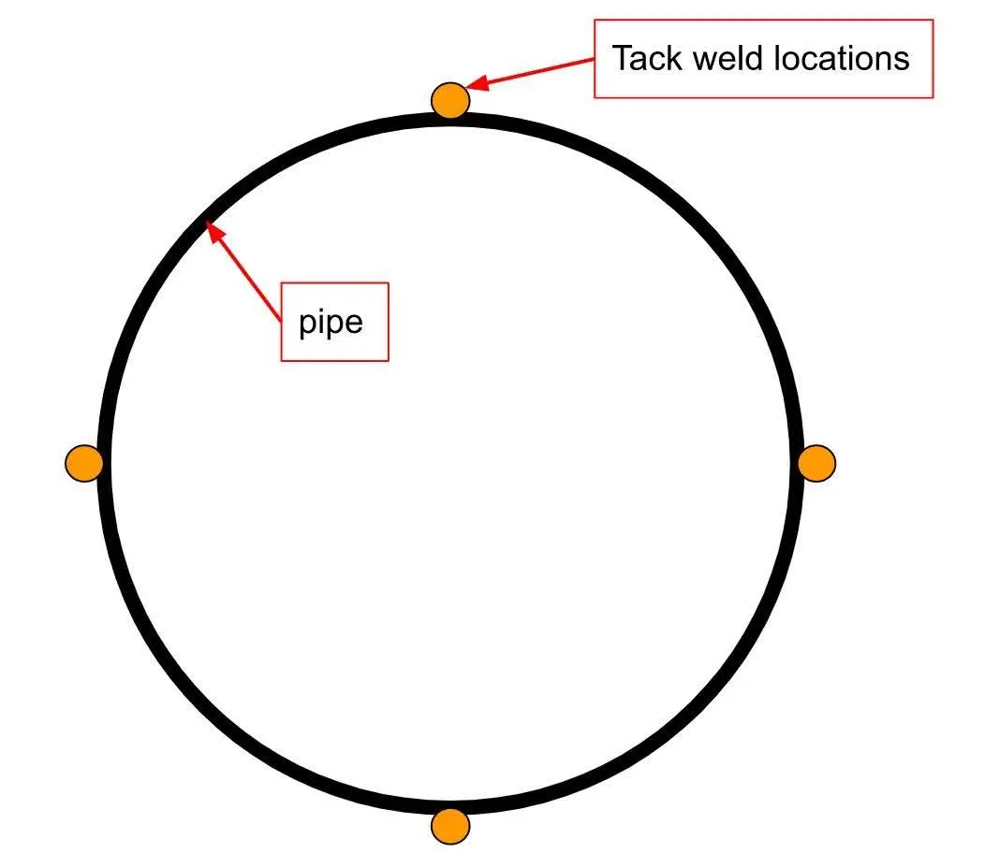
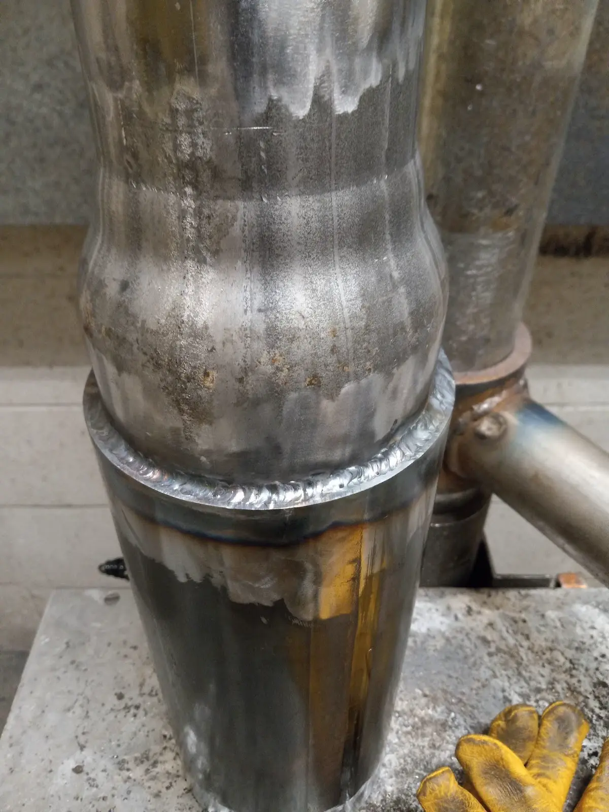
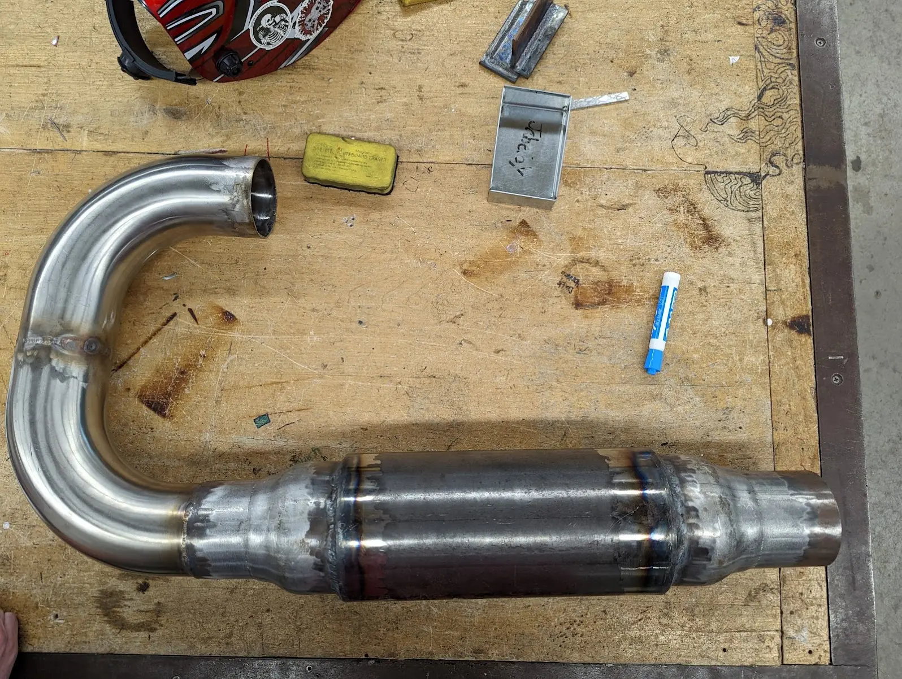

# Making a Valveless pulsejet

Hello

Haven't posted in a while and have been a bit busy with school.  I have decided to update you with one of my long and difficult projects. A project that might as well kill me if I am not careful enough. Yes, you read the title correctly, I am attempting to build a Valveless pulsejet. I have been working on this project for almost two years! Due to school and work finding the time to put this article together and post it took a significant amount of time, and well… and courage if i'm being honest.

At this point I can't remember my exact motivations for wanting to make a jet engine. When people ask me what I want to make a jet engine I respond with, “Why wouldn't you want to make a jet engine”

## What is a Valveless Pulse Jet? 

In order to understand what a Valveless pulse jet is you first need to understand what a [pulse jet](https://en.wikipedia.org/wiki/Pulsejet) is and how that may differ from a [valveless pulsejet](https://en.wikipedia.org/wiki/Valveless_pulsejet). Now I am no expert in this field, so my understanding of a pulse jet is limited to things I found online. In a nutshell a **valveless pulsejet** is a combustion engine that is capable of running with **no moving parts**. It gets its thrust from an oscillating explosion that occurs throughout the entire pipe.

The jet that I have been building is based on the [Lockwood-Hiller Design](https://patents.google.com/patent/US3462955A/en), which is basically a large deformed piece of metallic macaroni. I have referenced a decent amount of information on [Bruce Simpson blog](https://aardvark.co.nz/pjet/valveless.htm) about Valveless pulse jets. Feel free to read it if you want more information on the topic.

The size of the jet is not that much of an issue, I have seen people make much smaller ones that are mounted onto RC planes and even some made out of soup cans.

## Who In Their Right Mind Would Do This?   

Only crazy people of course, and I happen to fall into that bucket. I have spent little over a year just honing in the skill to weld together the body of the engine. I don't really know why I felt the need to do this? But I did.

That being said If you decide to use this site as instructions and obliterate yourself into a million tiny pieces, don't make me responsible. This is a risk I am taking for your entertainment.

Not to mention, whether or not this thing will end up working is another story. If all else fails, at least I learned something.

## Planning and Designing 

As of now I only have designs for the main body of the engine. I have yet to consider and design a fuel system that has all the necessary safety measures in place. Look, I get it, I walked into this. I know that building a jet engine is probably not the safest thing I could do with my free time.

I still don't want this thing to become a bomb, so I will create a separate post on how I set up the fuel system (once I figure that out).

I have linked other websites where you can find blueprints but I will include the ones I made here. They aren't very pretty but planning things out is always a good step to take.

My crappy blueprints I made on isometric graph paper.

The next thing to do is obtaining the parts and making sure you have all the necessary tools and skill to assemble the engine. Rember, the idea behind a valveless pulse jet is that it has no moving parts, thus making the manufacturing process more simple.

This project required me to weld all the pisces together so I would need all the appropriate [welding PPE](https://www.ccohs.ca/oshanswers/safety_haz/welding/ppe.html)  such as:

- Helmet
- Gloves
- Steel toe shoes
- Safety glasses

|                                                                   |                                                                              |        |
| ----------------------------------------------------------------- | ---------------------------------------------------------------------------- | ------ |
| Picture                                                           | Item                                                                         | Amount |
|           | 3.5" Stainless 90° Mandrel Bend Elbow                                        | x2     |
|                      | Stainless Steel T201 Exhaust Piping Reducer 3.5" to 4" Universal 3.7" length | x2     |
|  | 5" SCH 40 (5.563 OD X .258 wall) A-500 ERW Structural Steel Pipe             | x1     |

The next step would be obtaining all the parts if you want to base it off of my design. Another important step is making sure you have all the necessary tools to assemble the engine. Luckily for me I am enrolled in a technical school where they offer welding as a class. This way I could use their tools to work on this project. I have almost all the tools required at home. The only thing I was missing was a slip roll forming machine I used to make the exhaust cone.

Here is my minimum number of tools required to assemble the frame:

- TIG welder (better control on thin metals)
- slip roll forming machine
- Level
- Tape measure
- Angle grinder
- Belt grinder
- Variety of clamps

## Welding and Assembly

Here is the part you have all been waiting for, assembly.  I wanted to start off with assembling the combustion chamber as it was the easiest to weld. I slipped the reducers into either side of the combustion chamber and used 3/16 filler rod wire as a spacer to make sure it was centered. After making sure everything was level and centered I tack welded the two together. When tack welding the reducer the the combustion chamber I made sure **the tack welds are directly across from one another**. This is very important, otherwise when you go to weld the two together one side will pull on the other making the reducer crooked.

|                                                      |                                                                                     |
| ---------------------------------------------------- | ----------------------------------------------------------------------------------- |
|  |  |

At the time, I wasn't the best pipe welder so my welds did not come out perfect. I will probably go back and redo most of my welds on this project because they are a bit messy. Anyway after welding both reducers onto the combustion chamber you should have something that looks like this

Now that this part of the combustion chamber is complete I moved onto the “macaroni piece” made of the two 90 degree elbows. I probably could have found one piece that just loops around instead of welding two 90 degree elbows but as long as the jet engine loops around it should work as intended.

I then welded the elbow piece onto one one side of the combustion chamber and I ended up with something that looked like this.

Then again my welds here are the best but I fixed them later on.

### Making the cone

The next part of his project was the most challenging part, making the cone. This was much easier said than done and delayed my progress by many months. This post itself I believe is long enough, I will explain the brutal process I went through to make a cone out of steel in a later post.

<!-- https://github.blog/changelog/2021-09-30-footnotes-now-supported-in-markdown-fields/ -->
<!-- https://www.ijera.com/papers/Vol4_issue11/Part%20-%205/K0411055659.pdf -->
